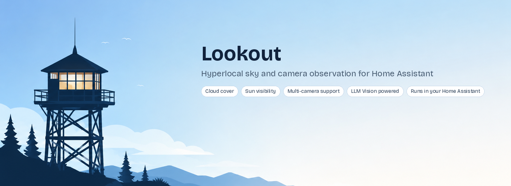

# Lookout

Hyperlocal sky and camera observation for Home Assistant, powered by
[LLM Vision](https://github.com/valentinfrlch/ha-llmvision). Lookout
reads your own outdoor cameras, not a regional forecast API, to
estimate cloud cover, fog, rain, and sun visibility for whatever spot
your cameras actually cover.

Runs entirely inside your Home Assistant instance. No account is
required beyond whatever LLM Vision provider you choose to use.

## Why hyperlocal

Standard weather integrations pull from a regional forecast covering
your whole area. Lookout looks at what your own cameras can actually
see right now, which can differ from the regional forecast: ground
fog with a technically clear sky, or one side of a property in full
sun while the other side is shaded by cloud.

## Features

- Cloud cover, per camera and averaged across all cameras
- Fog and haze detection, tracked separately from cloud cover, since a
  scene can have 0 percent cloud cover with heavy ground fog at the
  same time, or the reverse
- Rain detection, requiring actual visible rain in the scene (streaks,
  splashes, rippling puddles), not just a wet looking or dark image.
  The prompt also distinguishes water on the camera lens itself from
  rain in the scene, so a dirty or wet lens does not get reported as
  weather
- Sun visibility, true only when the actual solar disc is visible, not
  just a bright or glary scene
- Confidence scoring, per camera, lower when the view is limited,
  poorly lit, or obscured
- Effective Sky Obstruction sensor, combining cloud cover and fog into
  one number meant as the input for automations like Adaptive Cover
- Any number of cameras, each named by you, analyzed independently in
  a single LLM call per poll
- Daylight only polling, skips calling the LLM while the sun is below
  the horizon
- Adjustable scan interval, a slider from 1 to 30 minutes right on the
  device page
- Run Now button, forces an immediate analysis at any time, including
  at night
- Last Update sensor, the timestamp of the last time the LLM was
  actually successfully called
- Auto generated dashboard card at the end of setup, using the exact
  entity IDs Lookout just created

## Requirements

- Home Assistant 2025.7 or newer
- The LLM Vision integration, installed and with at least one provider
  configured
- At least one outdoor camera entity with a view of the sky

## Installing LLM Vision

Lookout depends on the LLM Vision integration to actually call a
vision model. Install and configure it first.

1. Install HACS if you do not already have it. See
   [hacs.xyz](https://hacs.xyz) for instructions.
2. In Home Assistant, go to HACS, search for LLM Vision, and install
   it.
3. Restart Home Assistant.
4. Go to Settings, then Devices and Services, then Add Integration,
   and search for LLM Vision.
5. Choose a provider. Google Gemini has a free tier and is a common
   starting point, but LLM Vision also supports OpenAI, Anthropic,
   local models through Ollama, and others.
6. If you choose Google Gemini, you will need an API key from
   [Google AI Studio](https://aistudio.google.com/apikey). Paste it
   into the provider setup screen.
7. Set a default model. Check your provider's current model list
   before picking one, since models are periodically retired. As of
   this writing, Gemini 1.5 and 2.0 Flash have both been retired by
   Google; a current Gemini 3.x model is a safer choice.
8. Submit the form. If you see an Invalid API key error, this
   sometimes means the specific model you entered is no longer
   available rather than an actual problem with the key itself. Try a
   different, currently supported model.

Once LLM Vision is installed and a provider is configured, you are
ready to install Lookout.

## Installing Lookout

### Via HACS, custom repository

1. In HACS, open the menu and choose Custom repositories.
2. Add this repository's URL, category Integration.
3. Install Lookout from the HACS store.
4. Restart Home Assistant.

### Manual install

1. Copy the custom_components/lookout folder into your Home
   Assistant config's custom_components folder.
2. Restart Home Assistant.

## Setting up Lookout

Go to Settings, then Devices and Services, then Add Integration, and
search for Lookout.

1. Provider and model: enter your LLM Vision provider ID and model
   name, and choose a scan interval from 1 to 30 minutes.

   The provider ID is not something you choose or type freely. It is
   a code LLM Vision generates when you set up a provider. The
   easiest way to find it: go to Settings, then Devices and Services,
   find your provider under LLM Vision, click it, then click the
   config entry and choose Copy Entry ID (or the equivalent copy icon
   next to the entry in newer Home Assistant versions).

   If that option is not available in your version, an alternative:
   go to Developer Tools, then Actions, search for
   llmvision.image_analyzer, switch to UI mode, select your provider
   from the Provider dropdown, then switch to YAML mode. The value
   shown after "provider:" is what you need, for example something
   like 01KZNE1DNHTE5CS7DEV5T9YG6H.
2. Add cameras: pick a camera and give it a name, one at a time. Keep
   adding as many as you have, or finish after one.
3. Dashboard preview: Lookout shows a ready to paste Lovelace card
   matching the entities it just created.

To add, rename, or remove cameras later, or to change the provider,
model, or scan interval: Settings, then Devices and Services, then
Lookout, then Configure.

## On providers

Lookout depends on the llmvision integration rather than calling a
provider's API directly. llmvision itself supports multiple
providers, including local vision models through Ollama, OpenAI,
Anthropic, and others.

This project's own testing has mostly used Gemini, because it has a
free tier. Switching the provider and model fields does not require
any code changes, but in practice not every provider or model behaves
identically, and problems have been reported with providers other
than Gemini:

OpenAI: earlier versions of Lookout produced a JSON schema that OpenAI
rejected outright with an error mentioning additionalProperties. This
was fixed in version 0.4.1, which adds the required
additionalProperties: false to the schema. Confirmed working since
the fix.

OpenRouter: confirmed working using the model ID openrouter/free,
OpenRouter's own free model router, which explicitly selects for
models that support image input and structured output together. This
has been tested against Lookout's full schema, including fog and
rain fields, not just a minimal example. Other free OpenRouter models
tested so far, including nvidia/nemotron-3-nano-omni-30b-a3b-reasoning:free
and minimax/minimax-m3:free, reason about the image correctly and get
every value right, but return the answer as readable text or Markdown
instead of raw JSON, which Lookout cannot parse. This looks like a
real model limitation around enforced structured output rather than a
schema bug, since the same models produce well formed JSON directly
in llmvision when given a flat, non nested schema (see the Ollama note
below for the same pattern).

Local models through Ollama: results are model specific, not a
blanket yes or no for local models in general.

Confirmed working: qwen2.5vl produced correct, accurate, properly
structured output, including the full nested per camera schema, in
testing. This is a genuine fully local, fully free option and the
current recommendation if you want to avoid a cloud provider
entirely.

Fixed in single camera setups as of 0.5.0: glimpse-v1 produced
correct, complete JSON when tested directly with a flat schema, but
returned an empty object when asked for the same fields nested under
a camera_1 key, which is how Lookout structured multi-camera
requests. As of 0.5.0, single camera setups use a flat schema instead
of nesting, matching what worked in direct testing. This has not yet
been re-confirmed against glimpse-v1 specifically through Lookout
itself; if you test this, a report either way is useful. Setups with
two or more cameras still use the nested schema, since a request
covering multiple images needs some way to distinguish which fields
belong to which image.

Confirmed not working, model returns nothing usable: qwen3-vl:8b
returned an empty response with no error. Not yet root caused; if you
hit this, try the same request with response_format left as text and
no structure field, to check whether the model can process the image
at all outside of a structured output request.

Not a Lookout issue: llama3.2-vision fails to load in Ollama entirely
with "unknown model architecture: 'mllama'", which is a known upstream
Ollama bug (see ollama/ollama issue 16547), not something specific to
Lookout or llmvision.

A note on manual testing: if you test a schema by hand in llmvision's
own Structure field, it must be valid JSON, no trailing commas, and
lowercase true and false. Python style syntax, which allows trailing
commas and capitalizes True and False, will fail with a JSON parse
error there even though Lookout's own code never has this problem,
since it builds the schema as a native object rather than typed text.

If Lookout logs llmvision returned no structured_response, check the
rest of that log line: as of version 0.4.1 it also shows whatever
llmvision actually returned, which usually makes it clear whether the
model ignored the schema, returned it in the wrong shape, or returned
nothing useful at all.

If you run into a provider or model that does not work, please open a
GitHub issue with the provider, the model name, and whatever appears
in the Home Assistant log. This is genuinely useful information for
improving compatibility, and several of the notes above came directly
from user reports.

## Troubleshooting

### Enabling debug logs

Home Assistant's default logging usually only shows failures, not the
detail needed to diagnose why something failed. To see more:

Settings, then System, then Logs, then the gear icon, then add
custom_components.lookout (and custom_components.llmvision if the
problem might be on that side) with level Debug.

Alternatively, add this to configuration.yaml and restart:

logger:
  default: warning
  logs:
    custom_components.lookout: debug
    custom_components.llmvision: debug

After reproducing the problem, check Settings, then System, then
Logs, for entries from either integration.

### "llmvision returned no structured_response"

This means llmvision's response did not include the JSON Lookout
expected. As of version 0.4.1 the error also includes whatever was
actually returned. Common causes, based on real reports so far:

The model returned readable text or Markdown instead of JSON, meaning
it does not reliably honor requested structured output.

The model returned valid JSON but not nested under camera_1, camera_2,
and so on the way Lookout's schema requires, which has been observed
with at least one local Ollama model.

The model was cut off before finishing, which is more likely with
reasoning models that spend part of their token budget "thinking"
before answering; try a higher max_tokens value if testing manually.

### "Provider config not found"

This means the provider ID saved in Lookout's configuration no longer
matches what llmvision currently has registered. Provider IDs can
change if a provider is reconfigured or recreated. Re-check the
current ID (see "Provider and model" under Setting up Lookout above)
and update it in Lookout's options.

## Entities

| Entity | Notes |
|---|---|
| sensor.lookout_sky_condition | Clear, Mostly Clear, Partly Cloudy, Mostly Cloudy, Overcast, Foggy, Rainy, or Night. Fog and rain take priority over the cloud based label. |
| sensor.lookout_effective_sky_obstruction | The higher of average cloud cover and average fog density. Use this for Adaptive Cover, not average cloud cover alone. |
| sensor.lookout_average_cloud_cover | Average cloud cover across all cameras |
| sensor.lookout_average_fog_density | Average fog and haze density across all cameras |
| sensor.lookout_average_rain_intensity | Average rain intensity across all cameras |
| sensor.lookout_camera_cloud_cover | Per camera cloud cover |
| sensor.lookout_camera_fog_density | Per camera fog and haze density |
| sensor.lookout_camera_rain_intensity | Per camera rain intensity |
| sensor.lookout_camera_confidence | Per camera confidence, diagnostic |
| binary_sensor.lookout_camera_sun_visible | True only if the solar disc is directly visible |
| binary_sensor.lookout_camera_fog_detected | Shows as Wet or Dry, moisture device class |
| binary_sensor.lookout_camera_rain_detected | Shows as Wet or Dry, moisture device class |
| sensor.lookout_last_update | Timestamp of the last successful LLM call, diagnostic |
| number.lookout_scan_interval | Adjustable 1 to 30 minute polling interval |
| button.lookout_run_now | Forces an immediate analysis, bypassing the daylight gate |

Camera specific entities use the name you gave each camera during
setup, for example sensor.lookout_front_cloud_cover.

## Using Effective Sky Obstruction with Adaptive Cover

If you use a cloud cover based sun protection automation, such as an
Adaptive Cover blueprint with a cloud cover sensor input expecting a
0 to 100 percent value, point it at
sensor.lookout_effective_sky_obstruction rather than
sensor.lookout_average_cloud_cover. The latter only reflects cloud
cover and would stay at 0 percent during ground fog under a clear sky.
The former accounts for both.

If your cameras face different directions and disagree meaningfully,
for example front camera in full sun while the back camera sees fog, a
single blended global sensor may not be precise enough for a cover on
a specific side of the house. Per camera obstruction sensors are a
reasonable future addition if that turns out to matter in practice.

## Roadmap

Sky: improved sky classification, cloud density as distinct from
simple percent cover, sunrise and sunset visibility.

Weather: smoke detection and storm detection. Fog and rain are already
implemented.

Camera health: spider web detection, dirty lens detection, condensation
detection, camera obstruction detection. This is deliberately not
combined with the sky analysis prompt, since it likely needs its own
prompt and schema so it does not dilute the accuracy of either.

Platform: historical observations and trends. Home Assistant's built
in long term statistics already accumulate automatically for every
sensor here, so basic history needs no extra code; dedicated trend
entities are a later step. A button to regenerate the dashboard card
on demand, after adding more cameras, is a reasonable next addition.

The goal remains a reliable observation system built on what outdoor
cameras can actually see, focused on observation rather than
automation itself.

## Changelog

0.5.0

Internal schema field renamed from ai_cloud_cover to cloud_cover.
Home Assistant entity IDs, dashboards, and automations are not
affected by this, since entities are named from your camera names,
not from this internal field. This only matters if you have manually
tested or built something against the raw structured_response JSON
using the old field name, for example a hand copied schema in
llmvision's own testing tools, or a custom automation reading the
service response directly. Update any such reference from
ai_cloud_cover to cloud_cover.

Rain detection logic changed in a way that will produce different
results than before, worth knowing about before updating. Previously,
rain_detected required visible motion in the scene, streaks,
splashes, or rippling puddles. In practice this meant steady light to
moderate rain, which often shows no visible motion in a single still
frame, was frequently missed. rain_detected now also considers
whether the sky in the same image is overcast and surfaces look
distinctly wet, treating that combination as real evidence of active
rain rather than requiring visible motion. To avoid the opposite
mistake, wet looking surfaces alone are explicitly not enough when
the sky is clear or the sun is visible, since that combination
usually means rain has already stopped and what is visible is
residual wetness while conditions clear. If you were relying on the
previous, stricter behavior, expect rain_detected to trigger more
often under genuinely overcast, wet conditions than it did before.

Single camera setups now use a flat schema instead of nesting fields
under a camera_1 key, matching what some local vision models were
observed to handle correctly when tested directly but not through
Lookout's previous nested request. Two or more cameras are
unaffected and continue to use the nested schema. This is handled
internally; the sensors and entities you already have are not
affected either way.

0.4.3

Documentation update. Confirmed qwen2.5vl as a working, accurate,
fully local model through Ollama, including with Lookout's full
nested per camera schema. Documented gemma3, minimax-m3, and the
nvidia nemotron reasoning model as not reliably producing valid
structured output, and llama3.2-vision as failing due to an unrelated
upstream Ollama bug. Added a note about manual testing requiring
valid JSON syntax rather than Python style syntax in llmvision's own
Structure field. No code changes in this release.

0.4.2

Documentation update based on real user reports. Added a simpler
method for finding the LLM Vision provider ID (copy entry ID from the
provider's config entry, rather than only the Developer Tools method).
Added a Troubleshooting section covering how to enable debug logging
and the meaning of the two most commonly reported errors. Updated
provider compatibility notes with confirmed OpenRouter results
(openrouter/free works, several specific free models return correct
values but in the wrong format) and a more precise description of the
Ollama nested-schema finding. No code changes in this release.

0.4.1

Fixed a schema bug that caused OpenAI to reject every request with an
Invalid schema error mentioning additionalProperties. The generated
JSON schema now includes additionalProperties: false at every object
level, which OpenAI's structured output mode requires. Error messages
when llmvision does not return a structured response now include
whatever llmvision actually returned, to make it possible to tell
whether a provider or model does not support structured output at
all, rather than showing a bare, unhelpful error. Setup instructions
now explain exactly where to find the provider ID, since this was
reported as confusing.

0.4.0

Added fog and haze detection, and rain detection, per camera and
averaged. Added the Effective Sky Obstruction sensor for automations
like Adaptive Cover. Sky Condition is now fog and rain aware. The
prompt now explicitly distinguishes lens contamination from actual
scene rain. Confidence sensors and Last Update moved to a Diagnostic
category on the device page. Added translations/en.json, which fixes
config flow fields rendering as raw field names on some Home Assistant
frontend versions.

0.3.0

Renamed from AI Sky Observer to Lookout. Rewrote the options flow to
mirror the setup flow's add camera loop instead of a raw YAML editor.
Added the scan interval slider, the Run Now button, and the Last
Update sensor. Confirmed working end to end on a live Home Assistant
instance, including a multi day test through storm conditions.

0.2.0

Rewritten from a YAML package into a proper HACS custom integration
with a real config flow. Cameras are a user named, arbitrary length
list instead of hardcoded camera_1 and camera_2. Added the auto
generated dashboard card.

0.1.x

Original YAML package version: helpers, script, automation, and
template sensors, hardcoded to two cameras.

## License

MIT. See LICENSE.
